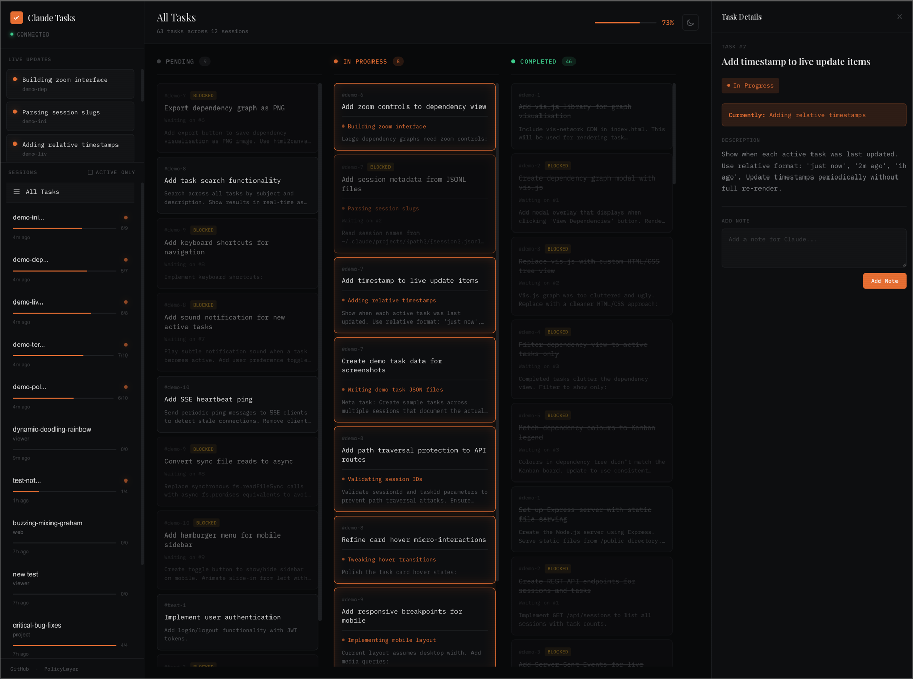
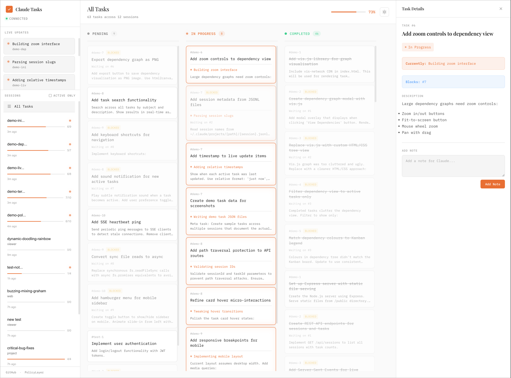

# Claude Task Viewer

A real-time Kanban board for **observing** Claude Code tasks. See what Claude is working on, track dependencies between tasks, and manage task cleanup and priority.





## Why Use This?

When Claude Code breaks down complex work into tasks, you get visibility into its thinking — but only in the terminal. Claude Task Viewer gives you a persistent, visual dashboard to:

- **See the big picture** — All your sessions and tasks in one place
- **Know what's happening now** — Live Updates show exactly what Claude is doing across all sessions
- **Understand task dependencies** — See which tasks are blocked and what's holding them up
- **Manage task priority** — Reorder tasks within columns to signal priority
- **Clean up completed work** — Delete tasks when no longer needed (with dependency checking)

## Key Features

### Observation-Focused Design
Claude Code controls task state — the viewer shows you what's happening:
- **Real-time status** — See tasks move through Pending → In Progress → Completed as Claude works
- **Active session detection** — Indicators show which sessions were recently modified or have in-progress tasks
- **Task dependencies** — Visualize blockedBy/blocks relationships to understand the critical path
- **Live activity feed** — Real-time stream of all in-progress tasks across every session

### Limited Interaction
The viewer supports two types of non-disruptive operations:
- **Priority management** — Drag tasks up/down within the same column to reorder by priority (tasks stay in their status column)
- **Cleanup operations** — Delete tasks with the delete button or press `D` (includes safety checks for dependencies and bulk delete for entire sessions)

### Session Management
View and organize your Claude Code sessions:
- **Session discovery** — Automatically finds all sessions in `~/.claude/tasks/` and `~/.claude/projects/`
- **View project paths** — See the full filesystem path for each project
- **Fuzzy search** — Search across session names, task descriptions, and project paths with instant filtering
- **Session limits** — Filter to show only active sessions or a specific number of recent sessions

### Keyboard Shortcuts
- `?` — Show help with all keyboard shortcuts
- `D` — Delete the currently selected task (with confirmation and dependency checking)
- `Esc` — Close detail panel or modals

## Installation

### Quick start

```bash
npx claude-task-viewer
```

Open http://localhost:3456

### From source

```bash
git clone https://github.com/L1AD/claude-task-viewer.git
cd claude-task-viewer
npm install
npm start
```

## How It Works

Claude Code stores tasks in `~/.claude/tasks/`. Each session has its own folder:

```
~/.claude/tasks/
  └── {session-uuid}/
      ├── 1.json
      ├── 2.json
      └── ...
```

The viewer watches this directory and pushes updates via Server-Sent Events. Changes appear instantly — no polling, no refresh needed.

## Task Structure

```json
{
  "id": "1",
  "subject": "Implement user authentication",
  "description": "Add JWT-based auth with refresh tokens",
  "activeForm": "Setting up auth middleware",
  "status": "in_progress",
  "blocks": ["2", "3"],
  "blockedBy": []
}
```

- `activeForm` — What Claude is doing right now (shown in Live Updates)
- `blocks` / `blockedBy` — Task dependency relationships

## Configuration

```bash
# Custom port
PORT=8080 npx claude-task-viewer

# Open browser automatically
npx claude-task-viewer --open
```

## API

| Endpoint | Method | Description |
|----------|--------|-------------|
| `/api/sessions` | GET | List all sessions with task counts and activity status |
| `/api/sessions/:id` | GET | Get all tasks for a session |
| `/api/tasks/all` | GET | Get all tasks across all sessions |
| `/api/tasks/:session/:task` | PATCH | Update task order (reordering within column only) |
| `/api/tasks/:session/:task` | DELETE | Delete a task (checks dependencies) |
| `/api/tasks/:session/delete-all` | POST | Delete all tasks in a session (with dependency-aware sorting) |
| `/api/events` | GET | SSE stream for live updates |

**Note:** Task state (status, subject, description) is controlled by Claude Code, not the API. The PATCH endpoint only supports updating the `order` field for priority management.

## Design Philosophy

**Observation over Control**: Claude Code owns task state. The task viewer's job is to show you what Claude is doing, not to direct it. This keeps the viewer in sync with reality and prevents confusion about whether a task's status reflects what Claude is actually doing or just human intent.

**Two types of interaction are supported:**
1. **Priority signaling** — Reorder tasks within columns. Claude reads the `order` field and may consider it when choosing what to work on next.
2. **Cleanup** — Delete completed or obsolete tasks to keep the board clean.

**Everything else is read-only:** Task status, subject, and description reflect Claude's actual work and can only be changed by Claude Code itself.

## Roadmap

### ✅ Completed
- **Real-time observation** — Live updates feed showing what Claude is doing across all sessions
- **Activity detection** — Active session indicators based on recent modifications and in-progress tasks
- **Task dependencies** — Visualize blockedBy/blocks relationships
- **Task reordering** — Drag tasks within columns to signal priority
- **Task deletion** — Delete tasks with dependency checking
- **Bulk delete** — Delete all tasks in a session with dependency-aware sorting
- **Keyboard shortcuts** — ?, D, Esc for quick actions
- **Session discovery** — Automatic detection of all Claude Code sessions
- **Fuzzy search** — Search across sessions and tasks

### 🚧 Planned
- **Enhanced search & filter** — Filter by status, dependencies, date ranges
- **Session grouping** — Group sessions by project or time period
- **Task timeline** — See when tasks were created and completed
- **Export** — Export session data for analysis or reporting
- **Desktop notifications** — Optional notifications when tasks complete

[Open an issue](https://github.com/L1AD/claude-task-viewer/issues) with ideas or feedback.

## License

MIT
