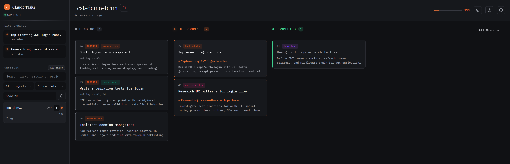

# Claude Code Kanban

[](https://www.npmjs.com/package/claude-code-kanban)
[](LICENSE)
[](https://www.npmjs.com/package/claude-code-kanban)

> Watch Claude Code think, in real time.




## Getting Started

### 1. Install hooks (one-time setup)

Hooks enable subagent tracking, waiting-for-user detection, and session activity indicators. **Without hooks, you only see tasks — no agent log, no live indicators.**

```bash
npx claude-code-kanban --install
```

This will:
- Copy `agent-spy.sh` to `~/.claude/hooks/` (requires `jq`)
- Add `SubagentStart`, `SubagentStop`, `TeammateIdle`, and `PostToolUse` hooks to `~/.claude/settings.json`

All changes are non-destructive — existing settings are preserved.

### 2. Start the dashboard

```bash
npx claude-code-kanban --open
```

Open http://localhost:3456 (or use `--open` to auto-launch the browser).

### 3. Use Claude Code as usual

Tasks, agents, and messages appear on the board automatically. No changes to your Claude Code workflow needed.

> To uninstall hooks: `npx claude-code-kanban --uninstall`

## Features

- **Real-time Kanban board** — Tasks move through Pending → In Progress → Completed as Claude works
- **Agent log** — Live subagent tracking (start/stop/idle) with prompts, duration, and status
- **Session message log** — Browse recent messages, tool calls, and model info (`Shift+L`)
- **Waiting-for-user indicators** — Amber highlight on sessions needing permission or input
- **Plan correlation** — Plan sessions linked to their implementation sessions
- **Agent teams** — Color-coded team members, owner filtering, member count badges
- **Task dependencies** — See blockedBy/blocks relationships and the critical path
- **Live activity feed** — Stream of all in-progress tasks across every session
- **Session management** — Fuzzy search, project/branch display, active/stale session styling
- **Cleanup** — Delete tasks (with dependency checks) or bulk-delete entire sessions
- **Keyboard shortcuts** — Press `?` for help; `Shift+M` for live message follow

## Configuration

```bash
PORT=8080 npx claude-code-kanban        # Custom port
npx claude-code-kanban --open            # Auto-open browser
npx claude-code-kanban --dir=~/.claude-work  # Custom Claude config dir
```

If port 3456 is in use, the server falls back to a random available port.

### Global install

```bash
npm install -g claude-code-kanban
claude-code-kanban --open
```

## How It Works

Claude Code writes task files to `~/.claude/tasks/` and conversation logs to `~/.claude/projects/`. The dashboard watches these directories with [chokidar](https://github.com/paulmillr/chokidar) and pushes updates to the browser via Server-Sent Events (SSE). Nothing is modified — the dashboard is read-only.

**Tasks** are picked up automatically from Claude Code's native task system (TodoWrite). No hooks needed.

**Hooks** extend observability beyond tasks. When installed, lightweight shell scripts fire on Claude Code lifecycle events and write JSON markers that the dashboard picks up:

| Hook event | What it enables |
|------------|----------------|
| `SubagentStart` / `SubagentStop` | Agent log — see subagent spawns, durations, prompts |
| `TeammateIdle` | Idle detection for team member agents |
| `PostToolUse` | Waiting-for-user detection (permission prompts, AskUserQuestion) |

## FAQ

**Does this control Claude?**
No. The viewer only observes — it never writes to task files or directs Claude's work.

**Does it work with agent teams?**
Yes. Team sessions are auto-detected with color-coded members and owner filtering.

**Does it require Claude Code to be running?**
No. You can browse past sessions anytime. Live updates resume when Claude starts working again.

**What happens without hooks?**
The Kanban board still shows tasks, but you won't see the agent log, waiting-for-user indicators, or live session activity. Run `npx claude-code-kanban --install` for the full experience.

## License

MIT
